# Return Ready Lab 17c

* Part C - Instructor Challenge 

## Part C - TDD Electronics

In this lab you are going to design classes to represent abstractions of the electronics listed below.

### Step 01 create the UML

### Camera
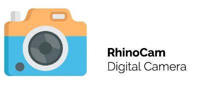

### Printer
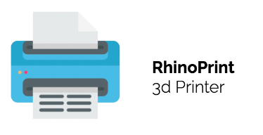

### Radio
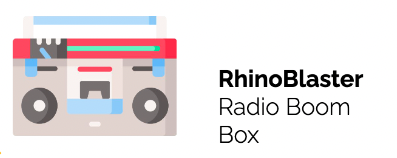

### TV
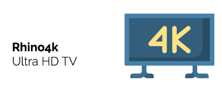

### Remote
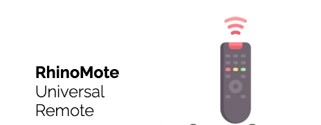

### WalkieTalkie
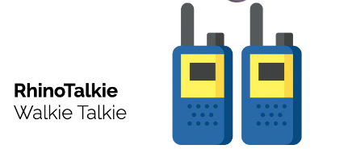

### Robot
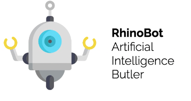

### Drone
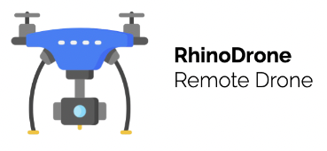

### Phone
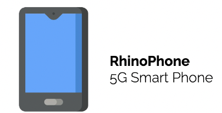

### Microwave
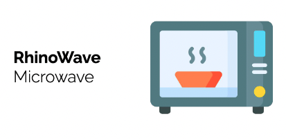

### Game Console
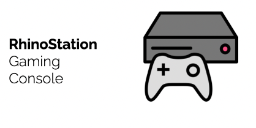